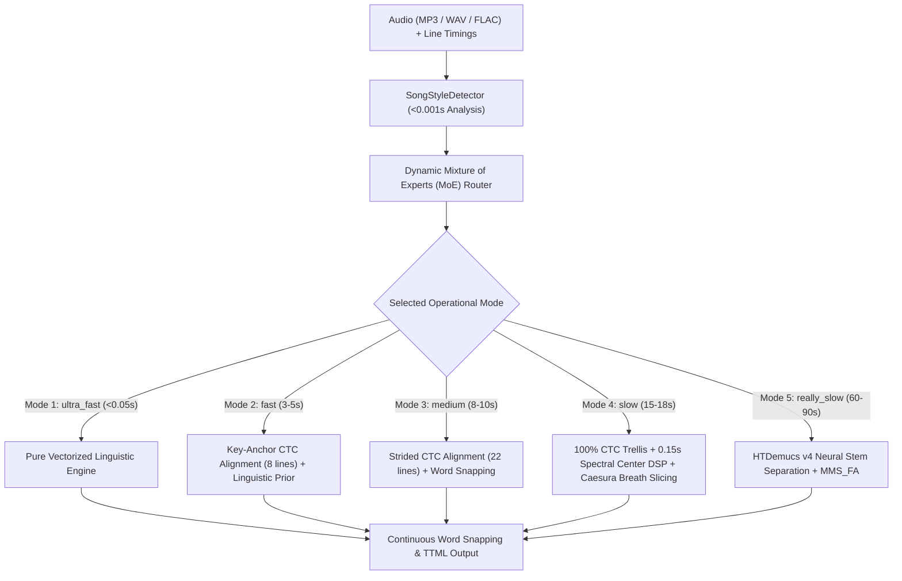

# Architecture & System Design

The Rich Synced Lyrics Alignment Engine ingests standard line-by-line synced lyrics (such as LRC or TTML container timings) and audio files to produce syllable- and word-level rich synced lyrics adhering to Apple Music and Spotify TTML specifications.

---

## 1. High-Level System Architecture

---

## 2. Core Modules & Code Structure

| Module | Location | Primary Responsibility |
| :--- | :--- | :--- |
| **`expert_router`** | `lyrics_aligner/expert_router.py` | Analyzes delivery cadence, character density, and tempo in <1ms to dynamically dispatch specialized expert weights. |
| **`acoustic_aligner`** | `lyrics_aligner/acoustic_aligner.py` | Orchestrates hybrid acoustic-linguistic alignment, budget-constrained CTC scheduling, and line dispatching. |
| **`model`** | `lyrics_aligner/model.py` | Residual neural linguistic prior with skip connections, estimating character delivery rates, grammatical POS elasticity, and syllable stress curves. |
| **`aligner`** | `lyrics_aligner/aligner.py` | Deterministic continuous tempo-cadence engine with punctuation boundary calibration. |
| **`vocal_aligner`** | `lyrics_aligner/vocal_aligner.py` | Offline deep neural vocal stem separation using Meta's HTDemucs v4 Transformer. |
| **`phonetics`** | `lyrics_aligner/phonetics.py` | 30-dimensional linguistic and phonetic feature extractor. |
| **`audio`** | `lyrics_aligner/audio.py` | High-speed FFmpeg PCM streaming and spectral envelope feature extraction. |
| **`evaluate`** | `lyrics_aligner/evaluate.py` | Word-level IoU and center tolerance scoring against ground-truth TTML benchmarks. |

---

## 3. Acoustic & Linguistic Fusion Math

For each word $i$ in a lyric line, the engine fuses the neural linguistic prior onset $t_{\text{prior}}(i)$ with the acoustic CTC trellis emission onset $t_{\text{acoustic}}(i)$:

$$t_{\text{fused}}(i) = (1 - \alpha) \cdot t_{\text{prior}}(i) + \alpha \cdot t_{\text{acoustic}}(i)$$

Where:
* **$\alpha$ (Acoustic Confidence Weight):** Dynamically tuned by the MoE router ($0.85$ for Rap, $0.75$ for Ballads, $0.55$ for Distorted Rock).
* **Gating Tolerance ($\text{gate\_s}$):** Enforces consistency between acoustic emissions and human singing tempo. If $|t_{\text{acoustic}} - t_{\text{prior}}| > \text{gate\_s}$, the acoustic onset is safely clamped to prevent instrumental break drift.
* **Consonant Attack Snapping ($\text{head\_snap\_us}$):** Adjusts initial consonant transients ($140\text{ms}$ for fast rap transients, $320\text{ms}$ for soft vowel ballad onsets).
